# Implementación de Microservicios

**Enunciado:**
Implementar un microservicio para un sistema de gestión de eventos. Debe permitir crear, actualizar, eliminar eventos y consultar por fecha.

Estoy utilizando *Arquitectura hexagonal*, también conocida como arquitectura de puertos y adaptadores. La principal idea es separar las preocupaciones
y dependencias externas del núcleo de la aplicación.

**¡IMPORTANTE!** El microservicio se ha documentado con JavaDoc para intentar dejarlo lo más claro posible.

El fin de este documento es hacer un pequeño manual de lo que nos devuelve *Postman*.

En proyecto está dividido en los siguientes módulos:
* **Domain**: Tenemos la entidad de negocio con anotaciones de *lombok* para ahorrar código. En este módulo también tenemos el repository que vamos a usar juntos con los casos de uso.
* **Application**: Aquí tenemos la implementación de los casos de uso declarado en la capa *domain*. Tenemos la anotación **@Component** para indicar que es un componente de Spring.
* **Infrastructure**: En este capa tenemos todo lo relacionado con la base de datos. Tenemos una entidad con anotaciones **JPA**, contiene también el repository que extiende de JPA, junto con la clase que lo implementa y las clases necesarias para realizar el mapeo.
* **Boot**: En este módulo tenemos la clase *main* para poder arrancar la aplicación.

***
## Base de datos tipo h2 
Para visualizar los datos. 

**Pasos:**
1. Arrancar la aplicación.
2. Acceder al siguiente enlace http://localhost:8080/h2-console/
3. Introducir la siguiente ruta jdbc:h2:mem:test, en User Name "root" y en Password "root" y pinchamos *Connect*.

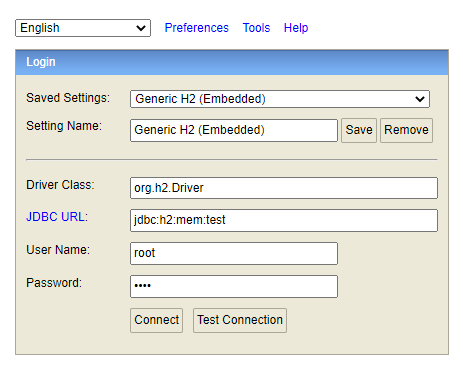
4. Una vez conectados, selecionaremos *PELICULAS* y clickaremos en *Run*.

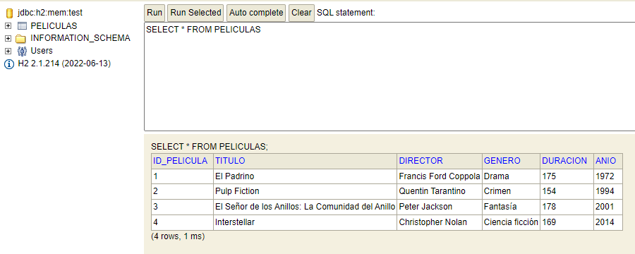
***
## Manual para arrancar la Aplicación

1. Nos dirigimos a módulo **boot**, *src* -> *main* -> *java* -> *com.neoris.peliculas* -> *main*.
Pulsamos *Run*.
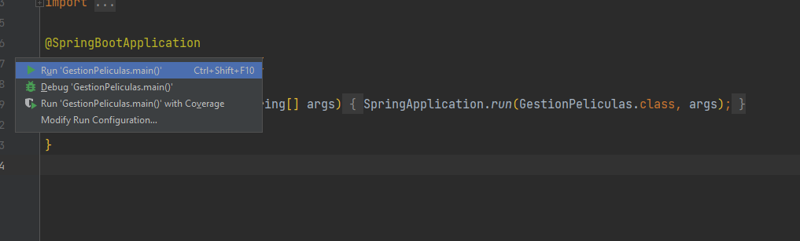
2. Vamos a *Postman* a comprobar que los métodos.

* Probamos el método *FindAllPeliculas*.

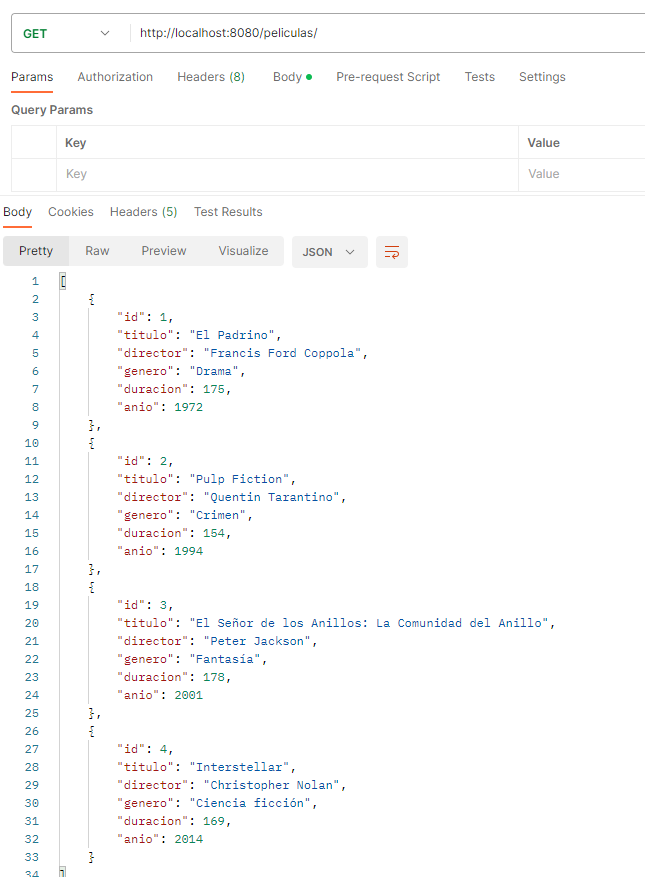

* Probamos el método *CreatePelicula*.

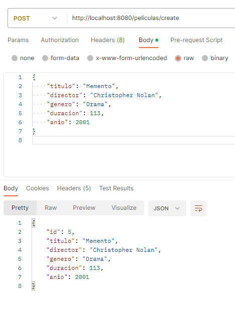

* Probamos el método *UpdatePelicula*. En este caso modificamos *anio* diciendo que es del 2014.

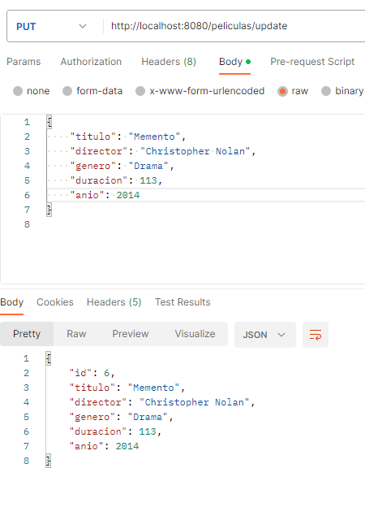

* Probamos el método *FindByTitle*.

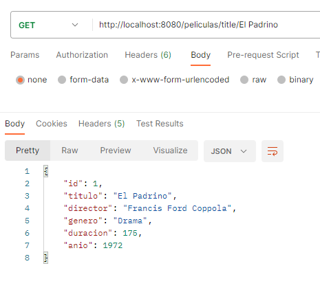

* Probamos el método *FindByGenre*.

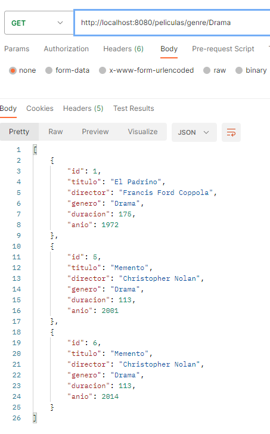

* Probamos el método *FindByAnio*.

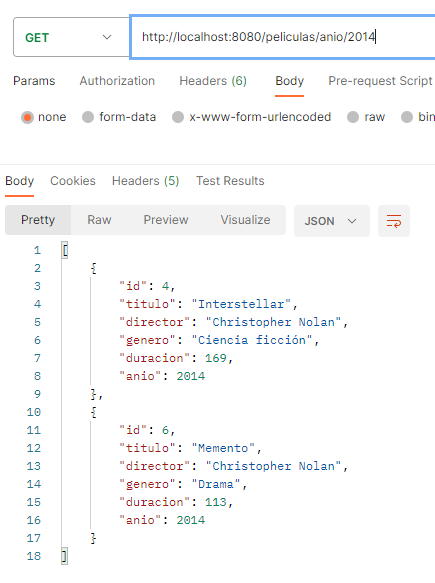

* Probamos el método *Delete*.

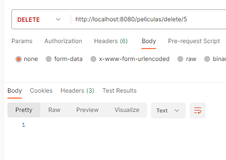

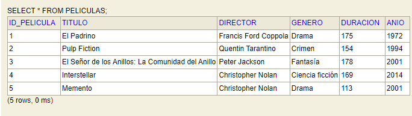

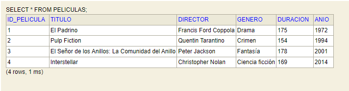
